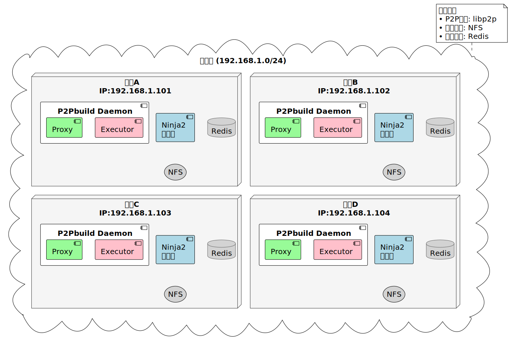
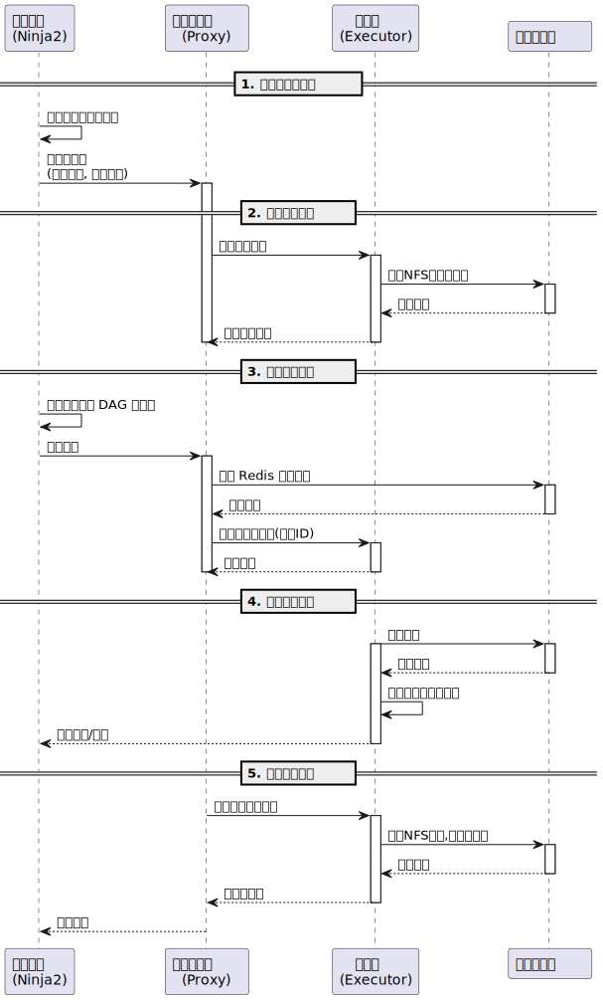
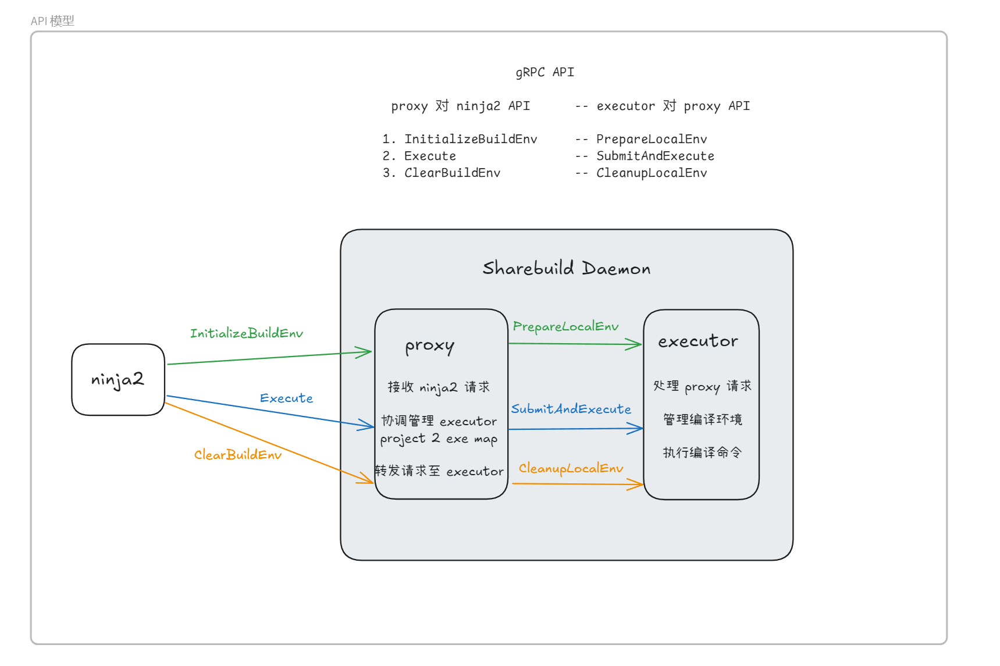

# Sharebuild(P2p分布式编译)

- [Sharebuild(P2p分布式编译)](#sharebuildp2p分布式编译)
  - [介绍](#介绍)
  - [特性](#特性)
  - [快速使用](#快速使用)
  - [基础架构](#基础架构)
    - [系统部署架构](#系统部署架构)
    - [业务流程](#业务流程)
    - [API模型](#api模型)
  - [AOSP 测评](#aosp-测评)

## 介绍

Sharebuild 是一个基于 P2P 技术的分布式编译系统，旨在提高大规模软件项目的编译效率。通过将编译任务分发到多个节点并行处理，Sharebuild 能够显著缩短编译时间。

## 特性

- **P2P 架构**：每个节点既是客户端也是服务器，能够动态发现和连接其他节点。
- **任务抢占调度策略**：网络中的工作节点抢占式执行编译任务，充分利用计算资源。
- **透明性**：结合 NFS 技术，所有工作节点共享客户端同一文件系统，底层分布式编译细节对用户透明。
- **零网络配置**：局域网环境内开箱即用，无需复杂的网络配置。

## 快速使用

1. 服务端：`sudo go run cmd/server/main.go`
2. 客户端：
   - 使用通用客户端 [ninja2](https://github.com/ninja-cloudbuild/ninja2/) 编译 LLVM, OpenCV 等项目。
   - 使用 [android_ninja](https://gitee.com/cloudbuild888/android_ninja/tree/sharebuild-android-12.0.0_r4/) 编译 AOSP.
  
  参考对应 ninja 项目地址的文档运行客户端即可。

## 基础架构
### 系统部署架构

### 业务流程

### API模型

更多细节参考 [Sharebuild-架构-API时序图](doc/Sharebuild-架构-API时序图.svg)

## AOSP 测评

[Sharebuild-AOSP编译测评](doc/Sharebuild-AOSP编译测评.md)

