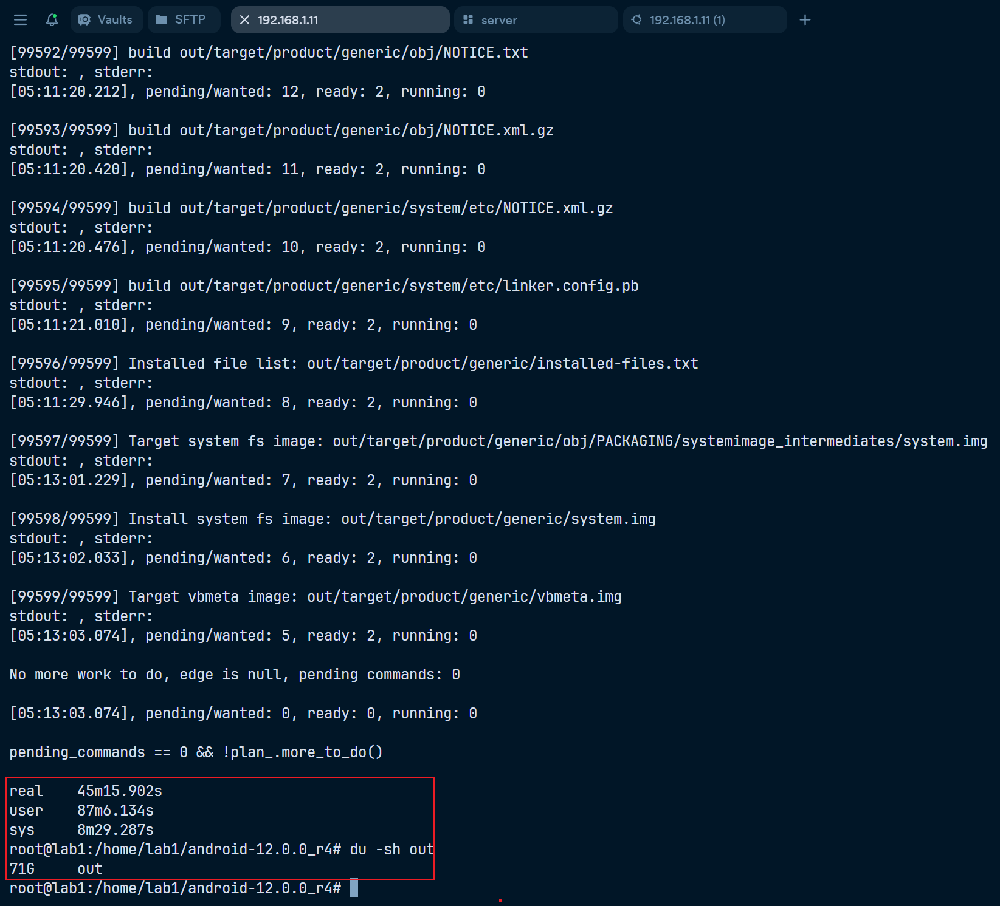
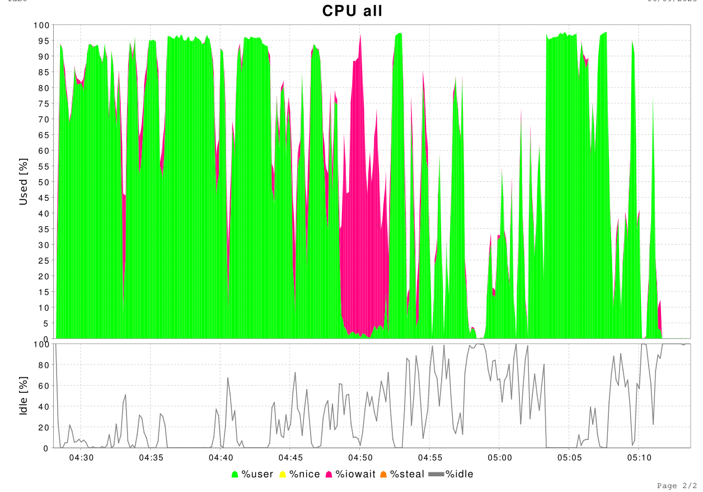
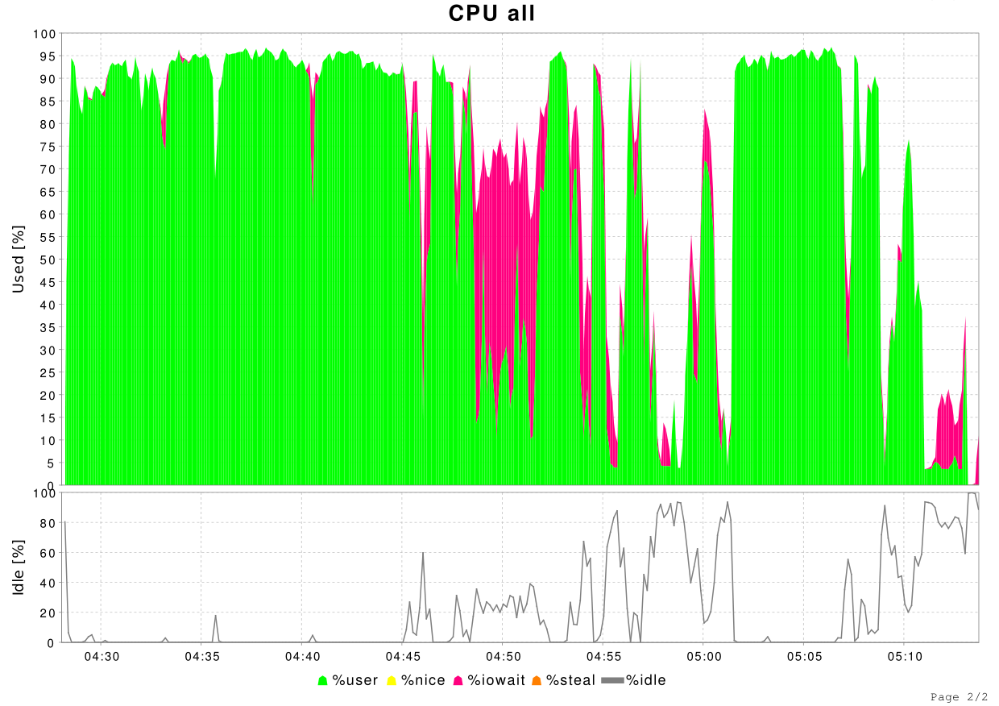
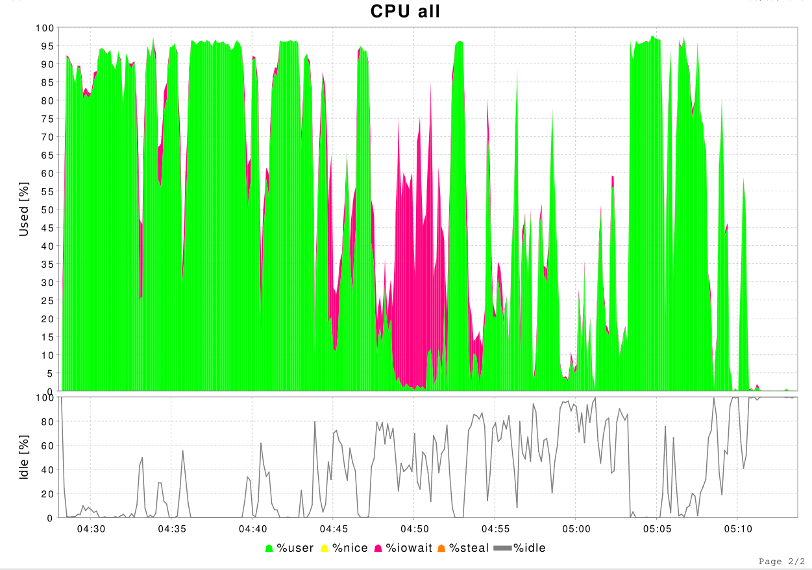
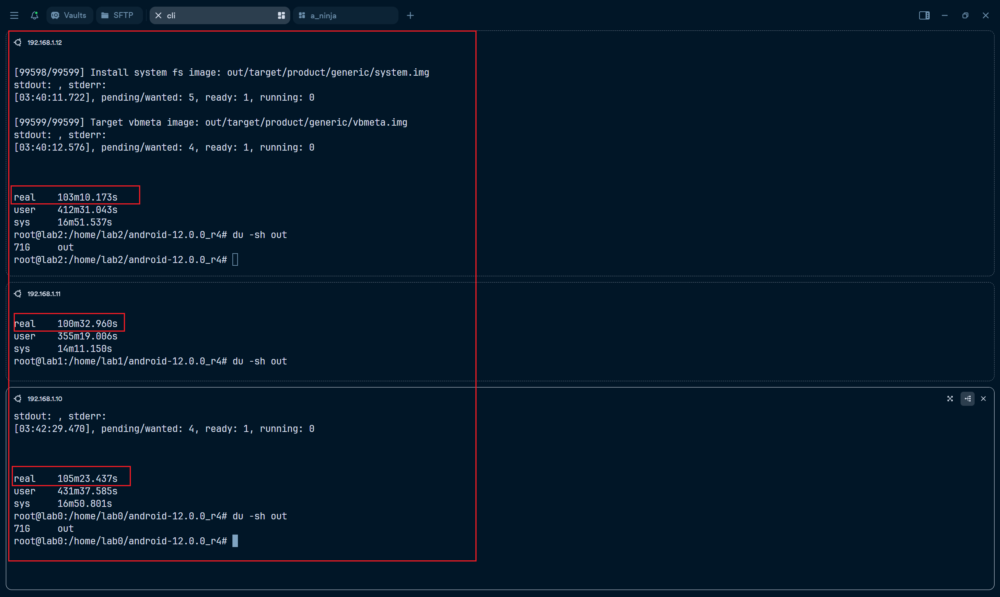

# AOSP 编译测评
## 目录

- [AOSP 编译测评](#aosp-编译测评)
  - [目录](#目录)
  - [1. 编译环境准备](#1-编译环境准备)
    - [1.1 系统与版本信息](#11-系统与版本信息)
    - [1.2 安装编译依赖](#12-安装编译依赖)
    - [1.3 下载 AOSP 源码](#13-下载-aosp-源码)
    - [1.4 配置 Sharebuild 环境](#14-配置-sharebuild-环境)
    - [1.5 编译流程](#15-编译流程)
  - [2. 编译性能测评结果](#2-编译性能测评结果)
    - [2.1 单机编译](#21-单机编译)
    - [2.2 单节点 Sharebuild 编译](#22-单节点-sharebuild-编译)
    - [2.3 三节点 Sharebuild 编译](#23-三节点-sharebuild-编译)
      - [编译结果耗时](#编译结果耗时)
      - [加速比计算](#加速比计算)
      - [任务争抢统计（PreemptedTaskCount）](#任务争抢统计preemptedtaskcount)
      - [CPU 利用率](#cpu-利用率)
    - [2.4 三节点同时作为客户端并发编译 AOSP（最坏情况模拟）](#24-三节点同时作为客户端并发编译-aosp最坏情况模拟)
      - [编译耗时统计](#编译耗时统计)
      - [并发编译结果图](#并发编译结果图)


## 1. 编译环境准备

### 1.1 系统与版本信息

- 操作系统：Ubuntu 22.04.4 LTS  
- AOSP 版本：android-12.0.0_r4  

### 1.2 安装编译依赖

```bash
sudo apt update && sudo apt install flex bison build-essential zlib1g-dev gcc-multilib g++-multilib libc6-dev-i386 libncurses5 lib32ncurses5-dev x11proto-core-dev libx11-dev lib32z1-dev libgl1-mesa-dev libxml2-utils xsltproc fontconfig -y && sudo apt install make git-core gnupg zip unzip curl python2 openjdk-11-jdk -y
```

### 1.3 下载 AOSP 源码

```bash
mkdir ~/bin && curl https://mirrors.tuna.tsinghua.edu.cn/git/git-repo > ~/bin/repo && chmod a+x ~/bin/repo 
export PATH=~/bin:$PATH

repo init --depth=1 --partial-clone -u https://mirrors.tuna.tsinghua.edu.cn/git/AOSP/platform/manifest -b android-12.0.0_r4
repo sync -j16
```

### 1.4 配置 Sharebuild 环境

```bash
# 安装启动 Redis
sudo apt update && sudo apt install redis-server -y
# Redis 开放局域网访问
sudo sed -i 's/^bind .*/bind 0.0.0.0/' /etc/redis/redis.conf
sudo systemctl restart redis

# 配置启动 NFS
echo '/home/ *(rw,root_squash,anonuid=1000,anongid=1000,insecure,async,no_subtree_check)' | sudo tee -a /etc/exports
sudo exportfs -a && sudo systemctl restart nfs-kernel-server

# 构建并启动服务端
go build -o sharebuild-server cmd/server/main.go && sudo ./sharebuild-server

# 可选：通过环境变量配置服务端行为，例如调整日志等级，设置编译任务存储地址(Redis), runner 后台协程数量
export LOG_MODE=development LOG_LEVEL=INFO STORE_HOST=192.168.1.11 POOL_SIZE=32 && sudo -E ./sharebuild-server

# 替换 AOSP 内部 ninja 为 android_ninja
cp android_ninja/build/ninja prebuilts/build-tools/linux-x86/bin/ninja

# 启用 Sharebuild 模式（也可通过命令行参数 -s 控制）
cd android-12.0.0_r4 && echo "sharebuild: true" > .ninja2.conf
```

### 1.5 编译流程

```bash
su  # 切换到 root 关闭沙箱（也可更改AOSP源码手动关闭 sandbox）
source build/envsetup.sh  # 初始化环境
lunch aosp_arm-eng  # 选择目标配置
m nothing  # 预编译阶段（排除干扰）

# 执行编译任务
time prebuilts/build-tools/linux-x86/bin/ninja -f out/combined-aosp_arm.ninja droid
```

---

## 2. 编译性能测评结果

**说明：**以下耗时统计**不包含**`m nothing`的时间。

### 2.1 单机编译

- 总耗时：**1小时33分32秒**（约 5612 秒）

### 2.2 单节点 Sharebuild 编译

- 总耗时：**1小时35分8秒**（约 5708 秒）

### 2.3 三节点 Sharebuild 编译

- 实验设置：lab0、lab1、lab2 三台机器同时启动服务端，在 lab1 上发起编译任务  
- 总耗时：**45分15.902秒**（约 2715.902 秒）

#### 编译结果耗时



#### 加速比计算

```text
加速比 = 单节点耗时 / 三节点耗时 = 5708 / 2715.902 ≈ 2.10
```

#### 任务争抢统计（PreemptedTaskCount）

```shell
lab0: "PreemptedTaskCount": 29770
lab1: "PreemptedTaskCount": 38021 (local executor)
lab2: "PreemptedTaskCount": 30371
```

#### CPU 利用率

- **lab0：**  
  

- **lab1：**  
  

- **lab2：**  
  

---

### 2.4 三节点同时作为客户端并发编译 AOSP（最坏情况模拟）

> 注：每个 executor 内部运行多个 ProjectRunner，因此建议适当减小 `POOL_SIZE`（如设为16）。

#### 编译耗时统计

- lab0：103分10.173秒  
- lab1：100分32.960秒  
- lab2：105分23.437秒  
- 平均耗时：**103分2.190秒**

```text
分布式并发编译平均耗时 ≈ 103 分钟 ≈ 6182 秒
对比单机编译耗时（5612 秒），慢约 570 秒 ≈ 9分钟3秒（慢约 10.2%）
```

#### 并发编译结果图


